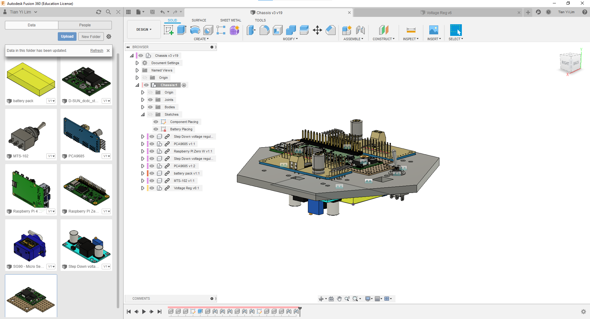
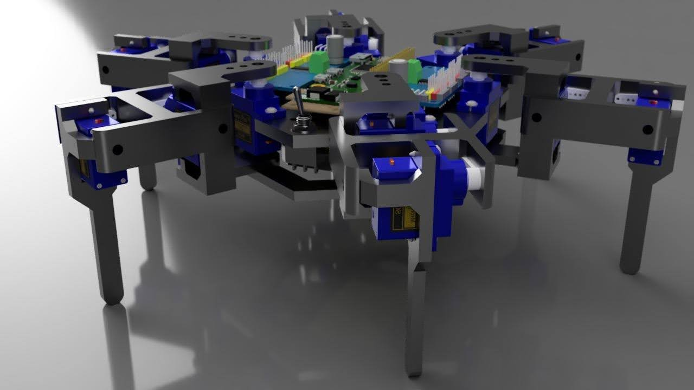
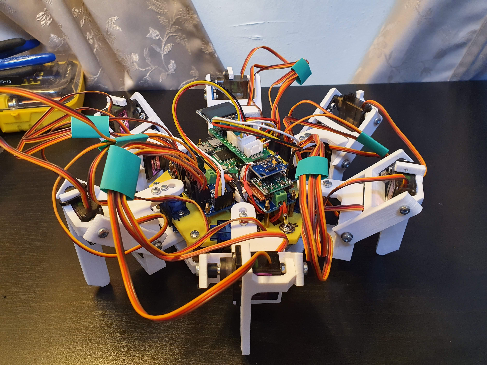

Over my Summer break in 2020, I built a 18-DOF hexapod robot. It had always been a dream for me to build something like this, and I'm glad that (perhaps because of COVID?) I finally had the time to do just that.

I mostly tried to follow Oscar Liang's wonderful [pointers](https://oscarliang.com/inverse-kinematics-implementation-hexapod-robots/) on Inverse Kinematics, adapting it to my use case. I found the trigonometry quite engaging to do, but stopped short of implementing rotational/translational matrices.

I mainly used a Raspberry Pi Zero, two PCA9685 I2C servo controllers, and a mix of SG90/MG90 hobby servos for the hardware. The chassis was modelled in Fusion 360.

  
   
  <i>Desiging the robot in Fusion 360. There were multiple components in the model and it taught me a lot about proper parametric design.</i>

The robot was then programmed in Python. I had just picked up how to use Matplotlib, Jupyter, and Numpy, so I decided to develop and test my walking algorithms using these technologies.

  
   
  <i>A render of the robot. Eventually I would use MG90 metal gear servos for the inner leg joints.</i>

On the firmware front, I interfaced with the PCA9685 servo controllers with Adafruit's software library. As I had opted to use a 2-cell LiPo battery as my power source, I opted to include an INA219 I2C current/voltage sensor to act as a rudimentary battery management system. A SSD1306 OLED screen was used so I could read out the current battery voltage (and other parameters). Again, Adafruit's Python libraries proved invaluable.

  
   
  <i>The final robot, in the flesh!</i>

I managed to complete the robot in time for a showacase the Imperial College Robotics Society was running at the time, and my video below impressed the juding commitee enough for me to win £40 from them :)

As I do more projects, my desire to stay closer to the algorithms and software increases. Perhaps I'm getting too old to solder...

_Video:_ <https://www.youtube.com/watch?v=wyfHojq9Sp4&ab_channel=TianYiLim> 
_GitHub Repo:_ <https://github.com/tianyilim/walkybot_code>
