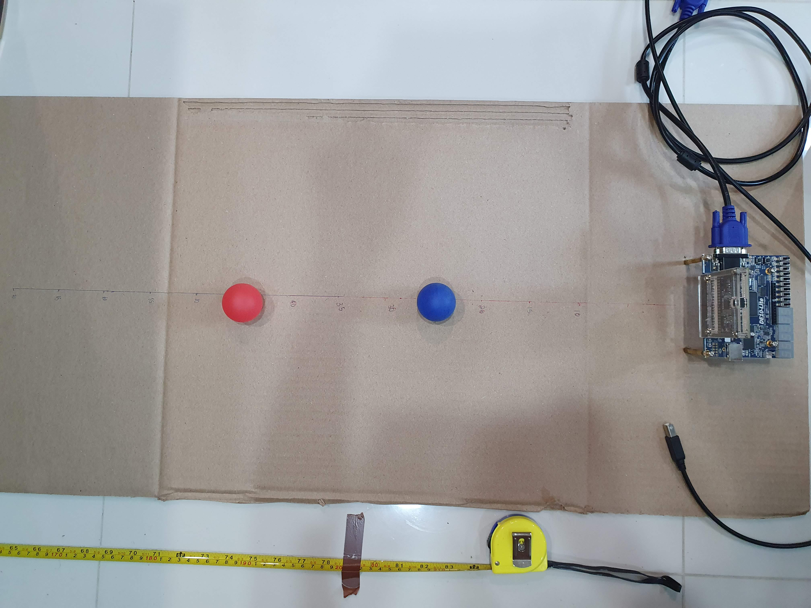

At the end of Year 2 of my undergraduate studies, I did a group project where group members were tasked to design different subsystems building up to an autonomous robot system (or "Mars rover"). As COVID was in full swing at that time, the idea was to be able to compartmentalize different subsystems of the rover so that people could remotely work on each subsystem individually.

There was not much "design" work to do per se, as the robot's hardware was standardized and sent to us in kits. Still, there were plenty of opportunities for interesting implementations in code.

  
   
  <i>A picture of the full rover running about.</i>

The different subsystems were:
- Command: Creating a website / high-level control scheme for the would-be robot operators to gain feedback on what the robot was doing.
- Control: Programming an ESP32 microcontroller to interface with the robots' other subsystems as well as with the Command system over the internet.
- Vision: Connecting a camera to a DE-10 Lite FPGA and using it for perception.
- Drive: Using an Arduino to drive the motors of the robot and interface with an optical flow sensor for state estimation
- Energy: Using an Arduino to monitor the charge status of the rover's batteries, as well as managing charging using solar cells.

I chose to do the _Vision_ subsystem, as at that point I was undecided on what I would specialise in. FPGA stuff seemed quite interesting at that moment, and the opportunity to implement CV algorithms in Verilog was cool.

My task was to detect the relative distance and bearing of coloured ping-pong balls away from the camera's point of view. In addition, detecting boundaries (ie. lines) of the play area was also required for obstacle avoidance.

  
   
  <i>The camera pointing at three of the five coloured ping-pong balls.</i>

Detecting lines and coloured circles is a fairly straightforward process using any run-of-the-mill sequential programming language, but the lack of memory elements on the FPGA meant that it was not possible to store a whole image to perform array-wise operations. Thus, the streaming nature of pixel data had to be taken into account. Furthermore, using an FPGA opened up possibilities for algorithm speedup by computing things in parallel.

The circle and line detectors were separate computations, and therefore processed in parallel.

  
   
  <i>Vision system architecture.</i>

Eventually, we needed to test our algorithms, and this testing rig was built to quickly and repetitively test without the need to attach the camera to the robot chassis. The testing rig elevates the camera to the height it would be mounted on the robot chassis.

  
   
  <i>A closeup of the testing rig to test the circle detection algorithm.</i>

  
   
  <i>Top view of the testing rig, showing the distance markings.</i>

Our full report can be found [here](../assets/Mars_Rover/MarsRover2021Report_Group22.pdf). Skip over to the Vision sections to see my contribution.

The code is not well-documented, but the project's GitHub page is [here](https://github.com/tianyilim/Mars_Rover). My Verilog files are mostly in `Vision/ip/EEE_IMGPROC`.