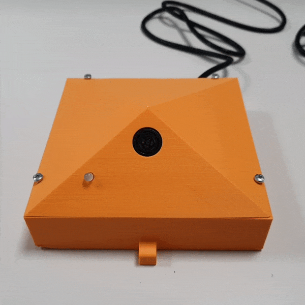
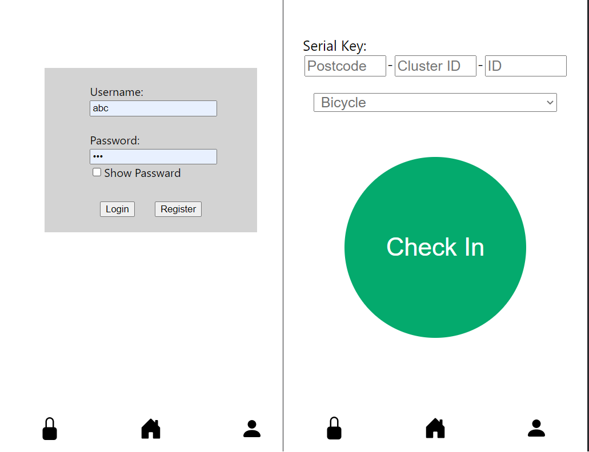
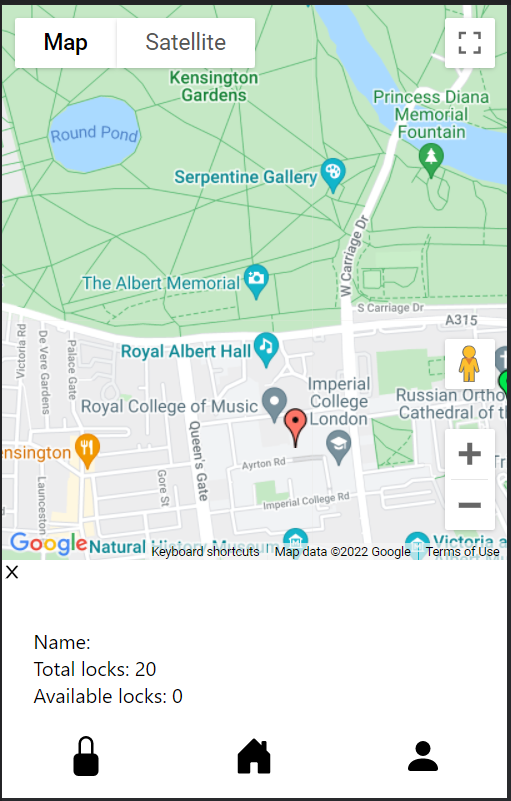
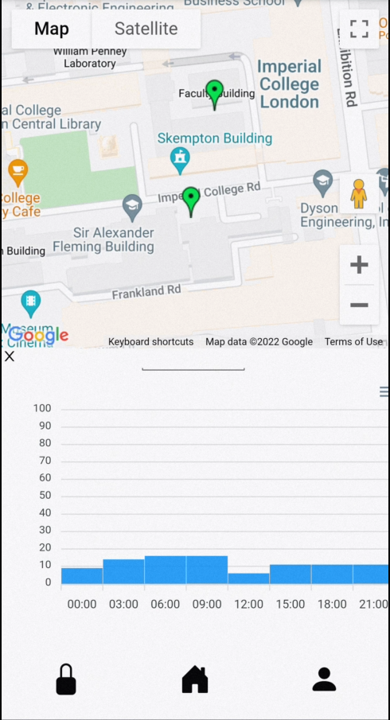
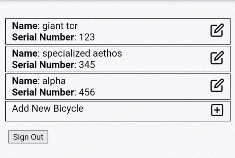
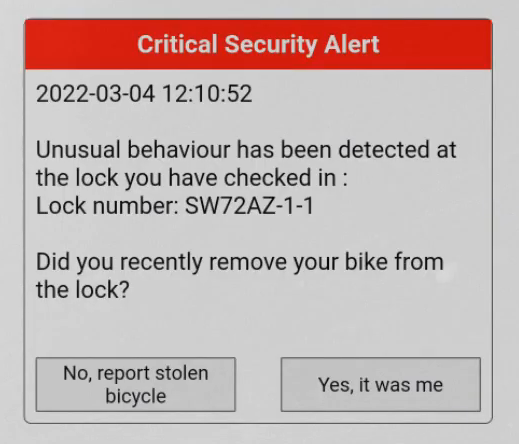

## Smart Bicycle Lock

My groupmates ([Carol Kwok](https://github.com/twk119), [Edvard Holen](https://github.com/EdvardJSHolen), [Sherwin da Cruz](https://github.com/sherwin-dc)) created a smart bike lock for cities around the world as part of a coursework for the Embedded Systems module.

Here is the [marketing website](https://tianyilim.github.io/Not-Lionel-s-CW1/).

And here is the marketing video.
<iframe width="560" height="315" src="https://www.youtube.com/embed/8JGS0eio5z4" title="YouTube video player" frameborder="0" allow="accelerometer; autoplay; clipboard-write; encrypted-media; gyroscope; picture-in-picture" allowfullscreen></iframe>

Lastly, the [GitHub repo](https://github.com/tianyilim/Not-Lionel-s-CW1) with our code.

---

### Motivation

While I was in London, I picked up cycling as a way of commuting. I think it's a great way to get about, especially with the cooler weathers that London/Europe has most of the year (unlike the ~30c heat of Singapore).

However, bike theft is prevalent in London, and usually if your bike is stolen there's not much you can do about it except buy a new one.

Therefore, for this piece of coursework where we had to think up a IoT product, we chose to build a smart bike lock. 

Instead of targeting a product for an end user, we thought it might be nice to take a page out of the Santander Bike locks in London, and create a smarter piece of infrastructure, which would also be able to provide statistics to cyclists and city planners alike.

### Hardware Implementation

In terms of electronic components, the device was fairly simple:
- Raspberry Pi Zero W for compute.
- Ultrasonic sensor to detect the presence of bicycles.
- Accelerometer to detect attempted bicycle theft.
- RGB LED to display status.
- Speaker for aural feedback.

All this was wrapped up in a snazzy orange 3D-printed case.

  
     

### Software Implementation

#### EC2 Cloud Server
The device communicates with a server on an AWS EC2 instance through the MQTT protocol. A `mosquitto` MQTT server is run on the EC2 instance, which allows many devices to individually connect to the EC2 instance. This should allow for the implementation to more scalable. Furthermore, the communications are encrypted via TLS.

#### Web App
A JavaScript web app was used for end users to interface with the system.

The app supports:

"Checking In" and "Checking Out" functionality of the system - letting the system know that you have put in a bicycle, and to watch over it while you are away.

  
     

Scrolling around a map to see the locations of bike locks.

  
     

Seeing the average utilization of locks across the day.

  
     

Adding and removing bikes, allowing for their IDs to be stored as well.

  
     

Alerting the user via email if an attempted theft was detected.

  
     

#### Database
A database was used to store user data and usage statistics, hosted on the EC2 server. This was implemented in SQLite. It could be accessed using the SQLite Python bindings and Javascript bindings.

### Future Extensions

We didn't have enough time to implement everything we wanted to in this project. Some extensions could be:
- Messaging Integration
  - Instead of notifying the user via email, push notifications via web app or to a Telegram/Whatsapp bot could be better.

- Anomaly Detection
  - Using unsupervised machine learning algorithms to analyze the accelerometer information, perhaps anomaly detection can be applied to the scenario, which allows for attempted thefts to be pre-empted.

- Data Analysis
  - More polished pathways for users and city planners to get insights about the enivronment. For instance, a heatmap visualization on vital stats.