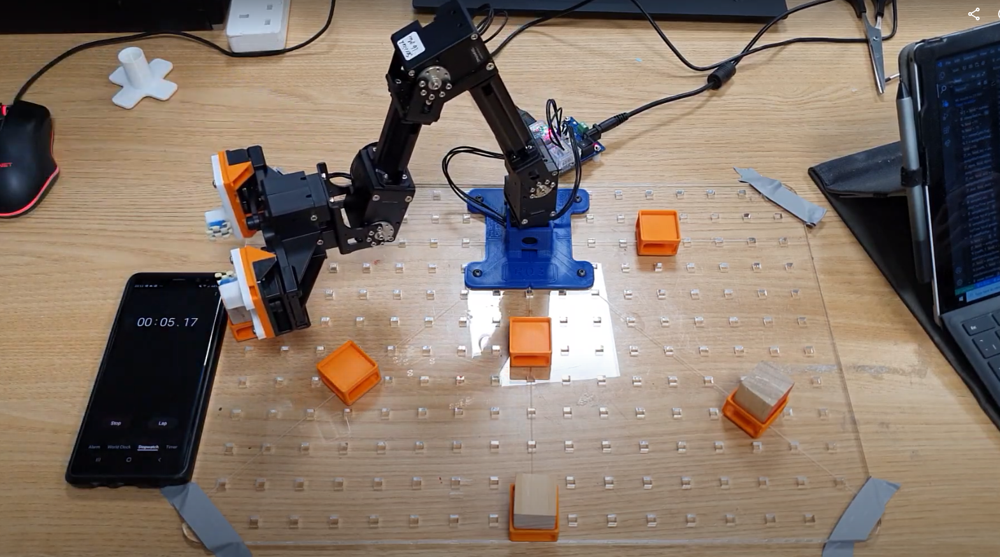
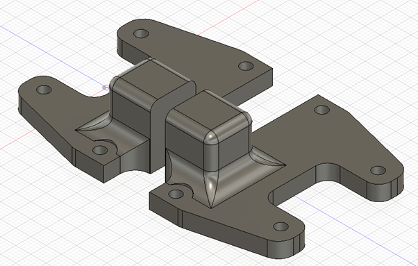
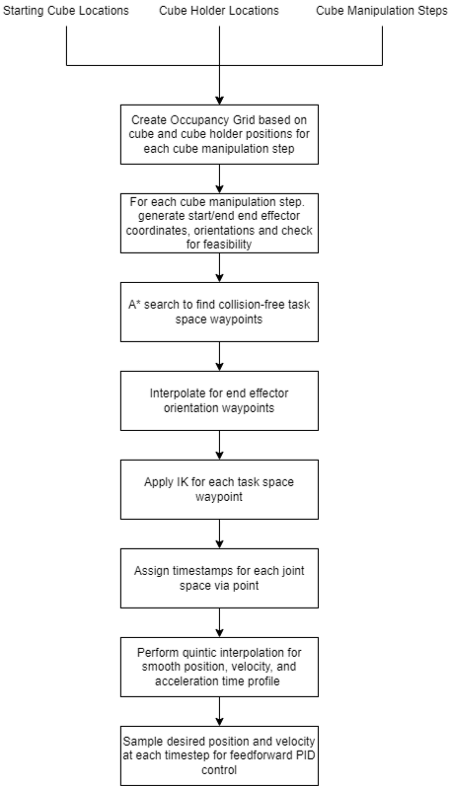
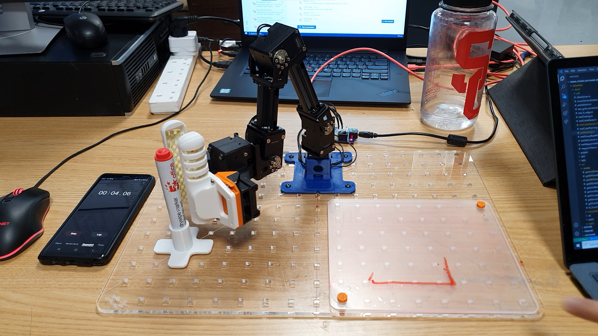
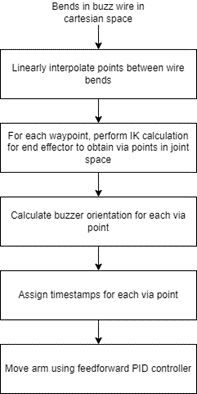

This coursework was done as part of the Robotic Manipulation module in Imperial College, taught by [Dr Ad Spiers](https://www.linkedin.com/in/ad-spiers-37228027/).

I did it with my groupmates [Alexander Pondaven](https://github.com/alexpondaven) and [Peter (Shuanghua) Liu](https://github.com/shl2019).

The coursework involved use of the ROBOTIS [Dynamixel OpenManipulator-X](https://emanual.robotis.com/docs/en/platform/openmanipulator_x/overview/) 4DOF Robot Arm. The robots were programmed in MATLAB.

Our summary video is here:

<iframe width="560" height="315" src="https://www.youtube.com/embed/YnikLz3zWbM" title="YouTube video player" frameborder="0" allow="accelerometer; autoplay; clipboard-write; encrypted-media; gyroscope; picture-in-picture" allowfullscreen></iframe>

This is one of the most rewarding courseworks that I've done, and it really opened my eyes to the cool stuff in the field of robotic manipulation. The writeup here is mainly a summary of what we did, and doesn't go into a lot of detail. If you want more info, I encourage you to look through our [report](https://github.com/alexpondaven/RoboMan/blob/main/RM%20Report%20-%20BOB.pdf) and [GitHub repo](https://github.com/alexpondaven/RoboMan).

Do reach out if you have any questions!

## 1. Forward Kinematics

The Denavit–Hartenberg (DH) parameters were used to model the forward kinematics (FK) of the robot. This is a convention that allows the transformation between the different coordinate frames that make up the robot to be defined.

In this case, as with most robotics applications (including ROS), the "right-hand" convention is followed, where coordinate frames look like this. Furthermore, by convention, $$x$$ is coloured red, $$y$$ green, and $$z$$ blue.

  

DH tables are comprised of the 4 DH parameters:
- $$d$$: offset along previous $$z$$ to the common normal.
- $$\theta$$: angle about previous $$z$$, from old $$x$$ to new $$x$$.
- $$a$$: length of the common normal, not to be confused with $$\alpha$$. Assuming a revolute joint, this is the radius about previous $$z$$.
- $$\alpha$$: angle about common normal, from old $$z$$ axis to new $$z$$ axis.

A DH table was derived: 

<table class="tg">
<thead>
  <tr>
    <th class="tg-0pky">$${i}$$</th>
    <th class="tg-0pky">$$\alpha_{i-1}$$</th>
    <th class="tg-0pky">$$a_{i-1}$$</th>
    <th class="tg-0pky">$$d_i$$</th>
    <th class="tg-0pky">$$\theta_i$$</th>
    <th class="tg-0pky">Remarks</th>
  </tr>
</thead>
<tbody>
  <tr>
    <td class="tg-0pky">0</td>
    <td class="tg-0pky">0</td>
    <td class="tg-0pky">0</td>
    <td class="tg-0pky">0</td>
    <td class="tg-0pky">0</td>
    <td class="tg-0pky">World Frame</td>
  </tr>
  <tr>
    <td class="tg-0pky">1</td>
    <td class="tg-0pky">0</td>
    <td class="tg-0pky">0</td>
    <td class="tg-0pky">34</td>
    <td class="tg-0pky">$$\theta_1$$</td>
    <td class="tg-0pky">Base of first servo</td>
  </tr>
  <tr>
    <td class="tg-0pky">2</td>
    <td class="tg-0pky">$$\pi/2$$</td>
    <td class="tg-0pky">0</td>
    <td class="tg-0pky">0</td>
    <td class="tg-0pky">$$\pi/2$$</td>
    <td class="tg-0pky">Intermediate Frame</td>
  </tr>
  <tr>
    <td class="tg-0pky">3</td>
    <td class="tg-0pky">0</td>
    <td class="tg-0pky">43</td>
    <td class="tg-0pky">0</td>
    <td class="tg-0pky">$$\theta_2$$</td>
    <td class="tg-0pky">Base of second servo</td>
  </tr>
  <tr>
    <td class="tg-0pky">4</td>
    <td class="tg-0pky">0</td>
    <td class="tg-0pky">128</td>
    <td class="tg-0pky">0</td>
    <td class="tg-0pky">$$-\pi/2$$</td>
    <td class="tg-0pky">Elbow between servos</td>
  </tr>
  <tr>
    <td class="tg-0pky">5</td>
    <td class="tg-0pky">0</td>
    <td class="tg-0pky">24</td>
    <td class="tg-0pky">0</td>
    <td class="tg-0pky">$$\theta_3$$</td>
    <td class="tg-0pky">Base of third servo</td>
  </tr>
  <tr>
    <td class="tg-0pky">6</td>
    <td class="tg-0pky">0</td>
    <td class="tg-0pky">124</td>
    <td class="tg-0pky">0</td>
    <td class="tg-0pky">$$\theta_4$$</td>
    <td class="tg-0pky">Base of fourth servo</td>
  </tr>
  <tr>
    <td class="tg-0pky">7</td>
    <td class="tg-0pky">0</td>
    <td class="tg-0pky">126</td>
    <td class="tg-0pky">0</td>
    <td class="tg-0pky">0</td>
    <td class="tg-0pky">End effector</td>
  </tr>
</tbody>
</table>

A visualization of these frames is here.

  

This allowed the robot to be simulated graphically in a MATLAB plot (using the `plot3` function). As per the frame convention, the long red, green, and blue lines are the $$x$$, $$y$$ and $$z$$ axes of the world. Robot links are modelled as thick black lines.

  

## 2. Inverse Kinematics

Inverse Kinematics (IK) are needed to create a transform from *task space* - the pose of the robot's end effector - to *joint space* - the angles at each robot's joint.

Look at the report for details on the derivation of the IK for this 4-DOF arm.

At first glance, a 4-DOF arm is difficult to obtain solutions for. The system is overdeterimined and there seem to be many possible configurations for a given desired end effector position. However, by also specifying the value of $$\theta_4$$ (the orientation of the 4th servo), the system returns to a 3-DOF system, which is easily broken down and solvable.

In a way, most higher-dimensional IK problems (4,5,6-DOF) should be solvable as such, by specifying the end effector's position **and** orientation, to obtain all joint values.

7-DOF systems are completely overdetermined, and that's why it's a lot harder to program for them. Here's hoping I'd have the chance to program one, one day.

## 3. Cube Manipulation

The next task that the team had to complete was a cube manipulation task.

  

As can be seen, there are holders for the cubes on a grid-map. The cubes must be moved and rotated according to the task.

### End effector
The coursework allowed for a custom 3D-printed end effector. This was designed in Fusion 360.

  

Some additional non-slip matting was cut to size and affixed to the 'jaws' of the gripper using double-sided tape. This can be seen in the demo video linked above.

The gripper was also modified to make it possible for the arm to reach cubes in orientations where the arm was "curled-up".

### The Generic Approach

It was a viable strategy in this coursework to hard-code everything. But that's not fun, so we set out to make the robot as autonomous as possible.

This short video shows the fruits of our labour - the task specification does not specify four cubes, but our parameterized approach handles it effortlessly. (You can also hear our very excited voices, lol.)

*video coming soon*

Here is a block diagram of our approach.

  

#### Path planning

The ol-reliable A* algorithm was used to plan a path for the end effector through the task space, keeping aware of collisions between the cubes the robot needs to manipulate, the ground, and also if the joint configuration of the robot is feasible. 

The "occupancy grid" was initially split into four dimensions: The $$x$$, $$y$$ and $$z$$ values, and the $$\theta_4$$ value of the end effector at each point. However, it was found that calculating a set of waypoints through 4-D space takes a *lot* of time, so only the $$x$$, $$y$$ and $$z$$ values were calculated for. The $$\theta_4$$ value is linearly interpolated through the motion of the arm, if necessary.

From one waypoint to the next, an IK calculation is performed, mapping the position and orientation of the end effector in joint space to something in task space.

#### Trajectory Generation

Quintic interpolation was used to obtain a smoother motion for the robot. The joint angles at each waypoint are known, but the time at which the end effector reaches these waypoints is not known.

By fitting the joint angles of each end effector onto a quintic (5-degree polynomial) curve, the curves are smooth in acceleration, velocitiy, and position, which leads to smoother motion.

The coefficients for each quintic curve was solved using the Power of MATLAB™ 😆 - we put constraints into a matrix `A`, results in a vector `b`, and solve for `x`.

Having a smooth trajectory is all well and good, but if the waypoints are not spaced out in time, the acceleration of the end effector is likely to still be very jerky.

Therefore, timings for the via points were assigned based on some heuristics, for instance using a 1D Laplace filter (difference of differences) to obtain the estimated accelerations of the joints as they move from waypoint to waypoint. The waypoints that have a larger estimated acceleration would be assigned a longer duration between each waypoint, to minimize the actual acceleration between points.

#### Feedforward control

The Dynamixels have three main control modes: Position, Velocity, and Torque. Position control mode was found to give jerky behaviour as the robot only has each incoming waypoint in mind. 

Velocity control mode with feedforward control was used. It has a characteristic equation: $$v_{out} = v_{feedforward} + K_p e(t) + K_i \int e(t) dx + K_d \frac{de(t)}{dt}$$.

This is essentially a PID controller with the desired setpoint also put in. Adequate tuning of the parameters allowed the robot arm to follow the desired trajectory well. However, owing to the mass of the end effector that was not considered, the robot moved still jerks a bit, especially when the arm is far away from the base.

Using Torque control mode and considering the actual dynamics of the robot (accelerations and inertias) affect the robot may have mitigated this, but could not be implemented in time.

## 4. Whiteboard Manipulation
Another task we had to do was to pick up a marker from a holder of our design with a gripper of our design.

  

Subsequently, the robot needs to draw shapes on the "whiteboard", comprising arcs of constant radius and straight lines.

The machinery we created earlier lent itself easily to this. Instead of needing to find a path through the environment, we just needed to translate the requested shapes into coordinates (waypoints), and generate a smooth trajectory through them.

Here's a block diagram of what we did.

  

### Waypoint Generation

One thing to note is that straight lines in task space rarely correspond to straight lines in joint space, and vice-versa. Therefore, in order to draw straight lines and arcs, points on these shapes must be sampled at regular intervals such that the joint angles that produce a trajectory of that shape are created.

For lines, this is an easy task: Linearly interpolate points between the start and end coordinates of the line with a fine enough spacing to obtain waypoints, and compute the joint angles corresponding to each waypoint to obtain a path.

For arcs, we broke down the arc into its mathematical representation and sampled points from it based on the start and end angle of the arc, which then gave us the required waypoints.

Subsequently, these waypoints are fed into the Trajectory Generation algorithm mentioned earlier, and feedforward control is again used to move the whiteboard marker.

## 5. Custom Task

For our custom task, we wanted to show off the control loop we had, so we decided on the robot arm playing a Buzz Wire game.

However, we soon realised that this required another degree of freedom to control the orientation of the end effector (the "loop" of the buzz wire stylus must be set perpendicular to the buzz wire itself).

Using our 3D modelling and printing skills, we designed a unique end effector that rotates the buzz wire stylus according to the position of the buzz wire.

Here's a block diagram of the software process.

  

