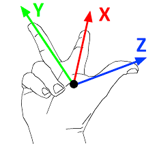
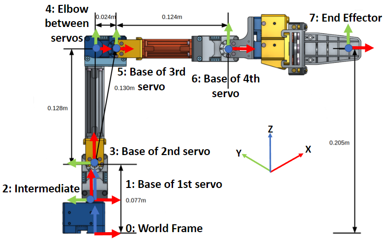
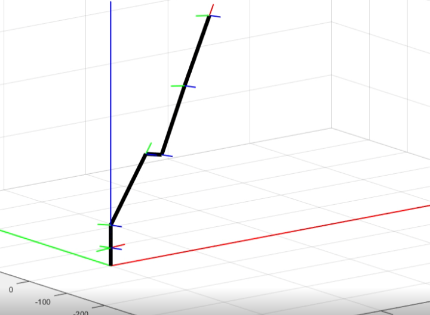

This coursework was done as part of the Robotic Manipulation module in Imperial College, taught by [Dr Ad Spiers](https://www.linkedin.com/in/ad-spiers-37228027/).

I did it with my groupmates [Alexander Pondaven](https://github.com/alexpondaven) and [Peter (Shuanghua) Liu](https://github.com/shl2019).

The coursework involved use of the ROBOTIS [Dynamixel OpenManipulator-X](https://emanual.robotis.com/docs/en/platform/openmanipulator_x/overview/) 4DOF Robot Arm. The robots were programmed in MATLAB.

Our summary video is here:

*link redirects to Youtube*

Do look through our [report](https://github.com/alexpondaven/RoboMan/blob/main/RM%20Report%20-%20BOB.pdf) and [GitHub repo](https://github.com/alexpondaven/RoboMan).

## Forward and Inverse Kinematics

The Denavit–Hartenberg (DH) parameters were used to model the forward kinematics (FK) of the robot. This is a convention that allows the transformation between the different coordinate frames that make up the robot to be defined.

In this case, as with most robotics applications (including ROS), the "right-hand" convention is followed, where coordinate frames look like this. Furthermore, by convention, \(x\) is coloured red, \(y\) green, and \(z\) blue.

  

DH tables are comprised of the 4 DH parameters:
- \(d\): offset along previous \(z\) to the common normal.
- \(\theta\): angle about previous \(z\), from old \(x\) to new \(x\).
- \(a\(: length of the common normal, not to be confused with \(\alpha\). Assuming a revolute joint, this is the radius about previous \(z\).
- \(\alpha\): angle about common normal, from old \(z\) axis to new \(z\) axis.

A DH table was derived: 

| Link Number (\(i\)) 	| \(\alpha_{i-1}\) 	| \(a_{i-1}\) 	| \(d_i\) 	| \(\theta_i\) 	| Remarks 	|
| ---	| ---	| ---	| ---	| ---	| ---	|
| 0 	| 0 	| 0 	| 0 	| 0 	| World Frame 	|
| 1 	| 0 	| 0 	| 34 	| \(\theta_1\) 	| Base of first servo 	|
| 2 	| \(\pi/2\) 	| 0 	| 0 	| \(\pi/2\) 	| Intermediate Frame 	|
| 3 	| 0 	| 43 	| 0 	| \(\theta_2\) 	| Base of second servo 	|
| 4 	| 0 	| 128 	| 0 	| \(-\pi/2\) 	| Elbow between servos 	|
| 5 	| 0 	| 24 	| 0 	| \(\theta_3\) 	| Base of third servo 	|
| 6 	| 0 	| 124 	| 0 	| \(\theta_4\) 	| Base of fourth servo 	|
| 7 	| 0 	| 126 	| 0 	| 0 	| End effector 	|

A visualization of these frames is here.

  

This allowed the robot to be simulated graphically in MATLAB:

  

