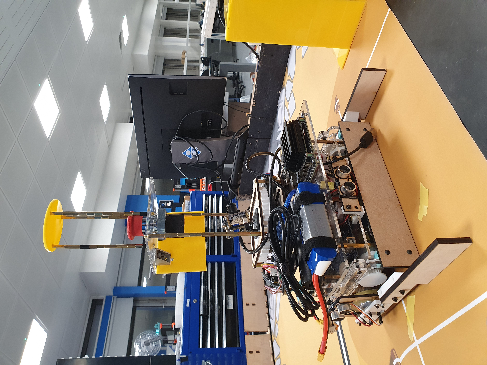

### Introduction

Over the course of 2021-2022, I competed in the [2022 Eurobot competition](https://www.eurobot.org/eurobot-contest/eurobot-2022/) along with members of the Imperial College Robotics Society (ICRS).

 
     
    <i>The map of the 2022 iteration of Eurobot</i>

The competition is an interesting one - two teams compete against each other on the same competition map, and each team can field up to two robots. This requires both collaborative and competitive strategies, which is very interesting!

Initially, I was very ambitious when I first picked up the competition in October 2021. I aimed for top points (to complete all missions). However, I failed to recognise that ICRS had not competed in Eurobot over COVID, and a lot of the know-how on the quirks of the competition had been lost. Furthermore, I was working with a relatively inexperienced team.

The consequence of this ambition was that my teammates were not very engaged with the work I assigned them. This hurt our motivation as a team, and subsequently many members dropped out of the war effort (myself included, as [coursework](2022-03-20-roboman_2022.md) piled up).

However, as the date for the UK-based competition drew nearer, [David Cormier](https://www.linkedin.com/in/david-ma%C3%ABl-cormier-2bab50195/) convinced me and a few others to give competing another shot. We had about 3.5 weeks to attempt to qualify for the competition, and we decided to give it our best effort.

I mainly worked on the CAD side of things, designing and fabricating the chassis(es) for the two robots we fielded. It was something I enjoyed a lot - I like to think that I would do Mechanical Engineering (or Mechatronics) if I had a second chance at choosing a Bachelors' degree.

 
     
    <i>Our Sweeper robot localised using a fixed ARUCO code, and moved to set points on the map to move field elements around.</i>

 
     
    <i>Our Grabber robot used line tracking to navigate to two separate points on the field, picking up and dropping off two cubes.</i>

In the end, we did not manage to make it to the following stage of the competition. However, I am sure the experience in competing will prove invaluable for the effort next year!

### Technical Details

The technical aspects of what we did are on the official Imperial College Robotics Society website [here](https://icrs.github.io/eurobot2022-UK/).

Here is an explained demo run of one of the robots.
<iframe width="560" height="315" src="https://www.youtube.com/embed/03TXz7Xkr34" title="YouTube video player" frameborder="0" allow="accelerometer; autoplay; clipboard-write; encrypted-media; gyroscope; picture-in-picture" allowfullscreen></iframe>

### Personal Reflections

I'm proud of my team for achieving all this in the short runway we had while juggling their busy placements / FYP work - we were all third year Computer Engineering students busy in our final term. In particular, I am thankful to David, who motivated me to put in this burst of effort in the first place, and got the ball rolling!

However, not everything went well. Some takeaways from the experience:

Firstly, great things need time to come to fruition. As much as what my team did was a great achievement in the span of less than a month, we didn't have what it took to win. Other teams with better management and motivation were able to spend much more time on developing a cohesive robot. Furthermore, they had some form of continuity between years, and didn't need to build software, hardware, and team infrastructure from scratch.

Secondly, winning isn't everything. At first, I was (very) disappointed that we were unable to continue to the next round. Upon reflecting, this was mainly because I was driven by results, rather than the process. I suppose doing things because I enjoy them instead of chasing paper results while being equally motivated is something I need to grow in!

Lastly, technical expertise must be paired with good management. At times it felt like we could have better utilized the manpower and the talent we had as a team, especially in giving team members of various skill levels opportunities to shine and take ownership of the project.

Although I have left Imperial at the time of writing this post, I hope the good people at ICRS will be able to carry the Eurobot torch far forward and do us proud! 😊