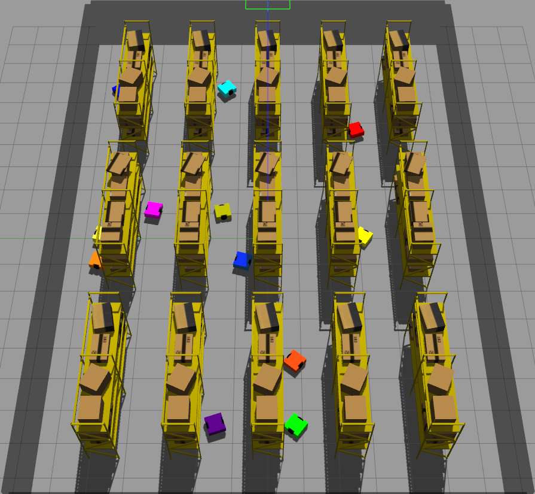
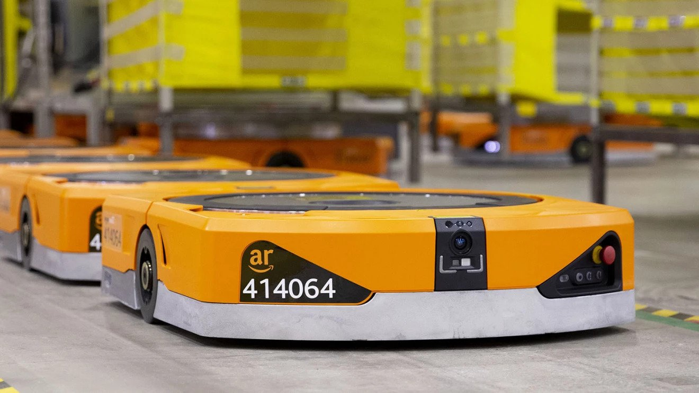

# Distributed Multi-Robot Trajectory Planning in a Warehouse Environment

My Final Year Project at Imperial College was a multi-robot trajectory planner. I was supervised by [Professor Andrew Davison](https://www.doc.ic.ac.uk/~ajd/index.html).

I used the Dynamic Window Approach (DWA) as a Local Planner, coupled with Rapidly-Exploring Random Trees (RRT) as a Global Planner.

The simulation environment was done in ROS2 Galactic, with a simulation environment created in Gazebo.

Initially, I wanted to make the [Eurobot competition](eurobot_2022) my focus, but hardware limitations (we didn't have a working robot 😔) meant that I had to change tack to something more simulation-focused.

## Simulation Environment

<p align="center">
  
  <br>
  <i>The simulation environment with multiple robots spawned within.</i>
</p>

I tried to create my own version of an Amazon warehouse, complete with robots inspired by the Amazon Pegasus Robots.

The shelves are laid out regularly in a grid shape, so it was possible to use `xacro` (**X**ML M**acro**) to parameterize for the rows and columns of shelves to generate a larger or smaller "warehouse" for the robots.

`xacro` does not support loops, so defining the rows had to be done with recursive macros ([solution link](https://answers.gazebosim.org//question/6883/creating-n-links-using-a-for-loop-in-xacro/)) - an interesting way to solve things! 

However, as extensibility/parameterization of the map was not a major consideration in my project, I opted to only implement this recursive macro for the rows of the shelves, and fix the number of columns at 3. (It would also be possible to run nested macros to solve this!)

<p align="center">
    
    <br>
    <i>Amazon Pegasus Robot</i>
</p>
<p align="center">
    
    <br>
    <i>Side View of my own robots</i>
</p>
<p align="center">
    
    <br>
    <i>Top View of my own robots</i>
</p>

My robots were simple square-shaped abstractions of the real Amazon robots. The URDF is defined as three cuboids - the front and back cuboids are the full width of the robot, while the middle cuboid is narrower to accomodate the robot's wheels.

## Learning about ROS 2

My supervisor encouraged me to implement everything from scratch, to better understand the concepts I was working with. Thus, I attempted to implement a global planner and local planner from scratch, focusing on the *trajectory planning* aspect of robotic navigation.

I started off by referencing the [demo code for Nav2](https://github.com/SteveMacenski/nav2_rosdevday_2021/), **the** recommended navigation stack for ROS 2. It was a useful starting point, but some concepts (eg. Behaviour Trees, Lifecycle Nodes) were definitely a bit too difficult to understand for a beginner 😅.

However, I was able to implement basic functions in ROS - Message publishers and subscribers, Service servers and clients, and Action servers and clients. Furthermore, I used the Launch framework to make sure everything started up conveniently. Lastly, the use of Parameters was useful, especially when tuning my controllers, or performing an evaluation.

Some good sources for tutorials, other than the [ROS2 documentation](https://docs.ros.org/en/galactic/index.html) and the [ROS2 Answers](https://answers.ros.org/questions/), were:
- [The Robotics Backend](https://roboticsbackend.com/category/ros2/)
- [A general robotics knowledge base](https://roboticsknowledgebase.com/)
- [ROS best practices](https://github.com/leggedrobotics/ros_best_practices/wiki)
- [ROS Galactic message/service types](https://docs.ros2.org/galactic/api/)
- [Gazebo plugin wiki](https://github.com/ros-simulation/gazebo_ros_pkgs/wiki)

The documentation for ROS2, especially for the Launch system, is poor. For Launch, you have to search up the different functions that exist, and somehow remember them. It would be great if a wiki or function encyclopedia is developed soon 😀

## Things of note

There were two points at which I found features / quirks of the ROS 2 + Gazebo system that were poorly documented, and which affected my progress greatly.

### Gazebo `gazebo_ros_diff_drive` plugin Odometry Source

As the focus of my project was trajectory planning, I opted to use ground truths for localization.

A headache I had was to obtain these ground truth transforms for each robot I was simulating. This was difficult because by default, the `gazebo_ros_diff_drive` plugin to control a differential drive robot with `geometry_msgs/msg/Twist` messages (target linear and angular velocities) counted the rotation of each robot's wheels, not using ground truths. This would be a big problem if robots collided with walls or each other and there was wheel slippage!

Eventually, on looking at the plugin source code (*sigh*), I noted that there was an option for `odometry_source`. This simplified my implementation significantly, and what I specified in my URDF is here:

```xml
<!-- ++++++++++++++++++++++++++++++ Diff Drive Plugin ++++++++++++++++++++++++++++ -->
<plugin name="$(arg prefix)_diff_drive" filename="libgazebo_ros_diff_drive.so">
    <!-- default namespace -->
    <ros>
    <remapping>/tf:=tf</remapping>
    <namespace>$(arg prefix)</namespace>
    </ros>

    <always_on>true</always_on>
    <update_rate>100</update_rate>
    <left_joint>$(arg prefix)_left_wheel_joint</left_joint>
    <right_joint>$(arg prefix)_right_wheel_joint</right_joint>
    <wheel_separation>${chassis_y-wheelwidth}</wheel_separation>
    <wheel_diameter>${wheeldiam}</wheel_diameter>
    <!-- Maximum torque which the wheels can produce, in Nm, defaults to 5 Nm -->
    <max_wheel_torque>20</max_wheel_torque>
    <!-- Wheel acceleration, in rad/s^2, defaults to 0.0 rad/s^2 -->
    <max_wheel_acceleration>1.0</max_wheel_acceleration>

    <odometry_frame>$(arg prefix)odom</odometry_frame>
    <robot_base_frame>$(arg prefix)_base_footprint</robot_base_frame>

    <!-- ##### ODOMETRY SOURCE IS HERE ##### -->
    <!-- 0 is encoder, 1 is world (ground truth) -->
    <odometry_source>1</odometry_source>
    
    <publish_odom>true</publish_odom>
    <publish_odom_tf>true</publish_odom_tf>
    <publish_wheel_tf>true</publish_wheel_tf>

</plugin>
```

### Gazebo `clock` publish frequency

As the project was entirely in simulation, each node listened to the `clock` topic published by Gazebo to determine when to take action.

On the other hand, as I wished to minimize the time waiting for results, I opted to run Gazebo faster than real-time. A reference thread is [here](https://community.gazebosim.org/t/gazebo-faster-than-realtime-operation/925/4).

This was done by setting the `real_time_update_rate` parameter in the World file to reflect the desired speed-up rate.

However, doing this suddenly resulted in inexplicably poor performance of my controllers (robots would crash or give control updates sluggishly).

After much Googling, I found that this was because Gazebo itself updates the `clock` topic (a measure of the time elapsed) only at 10Hz (wall-clock time) by default. This means that all ROS nodes recieve updates on the time elapsed 10 times each second in the real world. Therefore, they are only able to react at a capped 10Hz, realtime.

Not only does this mean that algorithms only run at a capped 10Hz when the real-time factor is 1.0, it hobbles robots when the real-time factor increases, as the effective rate is divided by the speedup factor.

To fix this, I increased the clock update rate.

First, create a YAML file containing the following. Set `publish_rate` to something sensible for your use case.
```yaml
gazebo:
  ros__parameters:
    publish_rate: 300.0 # or whatever rate you wish
```

When launching Gazebo from a Python Launchfile, now add the `extra_gazebo_args` launch argument:
```python
gazebo_cmd = IncludeLaunchDescription(
    PythonLaunchDescriptionSource(
        os.path.join(get_package_share_directory('gazebo_ros'), 'launch', 'gazebo.launch.py')
    ),
    launch_arguments={
        'world': world,     # specify your world file here
        'verbose': 'true',  # for debugging
        'extra_gazebo_args': f"--ros-args --params-file \"{gazebo_param_path}\"",
                            # Set `gazebo_param_path` as the path to the YAML file above
    }.items()
)
```
That solved it!

## Personal Reflection

Through the project, I learnt a _lot_ about ROS and Gazebo. It has left me feeling accomplished, but bittersweet - ROS is so powerful, but developing on it really is a *pain* - certainly not for beginner software developers!

It also hammered home the fact that I need to build good software engineering habits, especially since robotics development is so much in software, and to better collaborate with others in building the next big thing in robotics 😄 Here's looking forward to developing and deploying ROS to a physical robot!

At first, it was difficult to get into the rhythm of an individual research project, as I am someone who enjoys the process of working in a team a lot. However, once I got used to the self-directed nature of research, I would say that I welcome more challenges in the field of academia and research. I look forward to my Masters' program in Robotics, Systems and Control at ETH Zurich!

The two things I felt I could have done better are:
1. I should have committed more time to my literature review throughout the entire duration of the project. I ended up with tunnel-vision on making my code 'work'. However, when I did get down to reading more existing works, I felt there were some things I didn't implement because I simply hadn't read them yet!
2. I should have spent more time building up infrastructure to quantitatively evaluate my methods instead of fixing minor bugs in the implementation. This would have allowed me to collect more data to better evaluate my approaches.

To conclude, I am proud of the time I spent in Imperial College, and I can touch my heart and say I have no regrets! You are welcome to read more about the stuff I was up to in the [Portfolio](../portfolio.md) section of this site.

---

The GitHub page is [here](https://github.com/tianyilim/ic-fyp) and my report is [here](https://github.com/tianyilim/ic-fyp/blob/main/doc/final_report.pdf).

Do reach out if you have any questions, or this write-up has helped in any way 😀