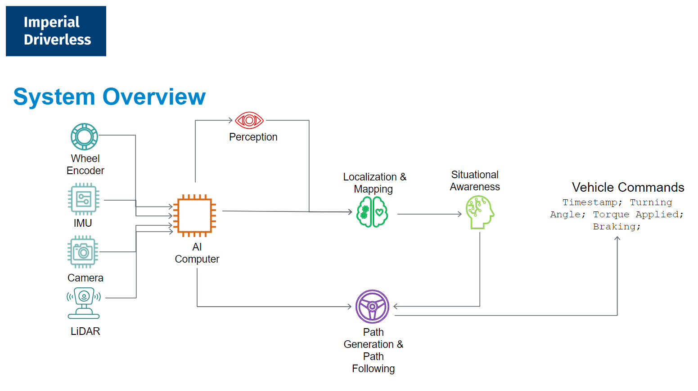
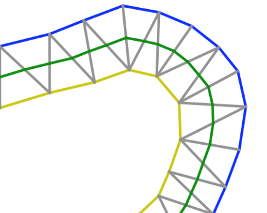
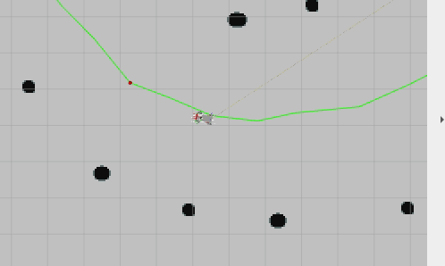
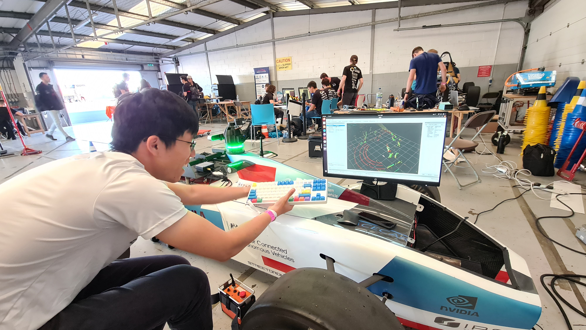

# Competing at Formula Student - Artificial Intelligence 2022 with Imperial Driverless

Along with the [Imperial Driverless](https://driverless.imperial.ac.uk/) team, I competed in the Formula Student - Artificial Intelligence ([FS-AI](https://www.imeche.org/events/formula-student/team-information/fs-ai)) competition in July 2022.

  
   
  <i>The team on the Silverstone Pit Straight.  
  Top row left to right: <a href="https://www.linkedin.com/in/henry-a-palasciano-9647a9196/">Henry</a>, <a href="https://www.linkedin.com/in/mateusz-lichota/">Mateusz</a>, <a href="https://www.linkedin.com/in/j-michalski/">Jakub</a>, me.  
  Bottom row left to right: <a href="https://www.linkedin.com/in/pietro-vitiello-737167196/">Pietro</a>, <a href="https://www.linkedin.com/in/mario-l-b0a938172/">Mario</a>, <a href="https://www.linkedin.com/in/fahmy-adan-5225a3125/">Fahmy</a></i>

We competed in the Dynamic Driving Task (DDT), where a bespoke autonomous platform, the Autonomous Driving System - Dedicated Vehicle (ADS-DV) is provided by the organizers and shared amongst competing teams.

    
     
    <i>The Autonomous Driving System - Dedicated Vehicle (ADS-DV) that the competitors had to share.</i>

Teams 'upload' their code in the form of a bootable SSD that slots into a In-Car PC at the rear of the ADS-DV, which then can interface with a sensor mount that teams design, placed on the front of the car. Our team used ROS 2 Galactic as a backbone to build the software for the car.

    
     
    <i>The University of Edinburgh's custom sensor mount, including several ZED cameras and a Velodyne lidar.</i>

## Competition Structure

### Dynamic Events
The competition has four main events:

1. Acceleration: Akin to a drag race, the car accelerates in a straight line for 75m as fast as possible.
2. Skidpad: The car needs to negotiate a figure-of-eight track to test its overall lateral grip.
3. Autocross: The car drives as fast as possible along a previously-unknown track.
4. Trackdrive: The car drives 10 laps around a track.

The tracks are demarcated with blue cones on the left and yellow cones on the right. There are penalties if a cone is struck.

### Static Events
In addition to the dynamic events with the vehicle, there are also static events (ie. presentations).

These include a business proposal presentation, a presentation of the applications of self-driving AI in the real world, and an explanation of the technical methods taken by the teams in simulation development and engineering design.

In this post I will detail my contributions to the dynamic events. My teammates did a fantastic job with the static events, placing us 4th out of 8 teams in the static events (not bad for a first year!)

## Technical Details

### Program Structure

    
     
    <i>System architecture.</i>

The system's sensors are the wheel encoder, IMU, a Velodyne Lidar, and a ZED camera.

#### Odometry

The wheel encoder is used for odometry information (by tracking the rotations of the wheels). However, as with all encoder-based odometry, it is liable to inaccuracy from wheel slip and variances in actual wheel diameter owing to the flexibility of tires.

The IMU captures the accelerations and rotations experienced by the robot. These readings can be integrated over time to give an approximation of the distances travelled by the robot. However, this is prone to *drift*, due to the presence of the $$+c$$ term present whenever integration is done (remember high school math?).

To that end, the wheel encoder and IMU feedback are typically *fused* using an Extended Kalman Filter (EKF). The ROS2 node for EKF is used [source code](https://github.com/cra-ros-pkg/robot_localization/tree/galactic-devel), [wiki](http://docs.ros.org/en/noetic/api/robot_localization/html/index.html). This gives a more accurate estimation of the overall odometry of the robot.

#### Perception

The lidar is able to detect the location of the cones accurately, but not the colour of the cones. Conversely, the camera is able to determine what colors the cones are, but typically faces large inacuraccies in estimating the position of the cones.

The lidar detection method uses clustering to detect cones near the car in a pattern that would be expected from a circular object (ie. a slice of a cone).

The camera detection method runs the YOLO-V3 algorithm on each of the stereo camera's images, and runs a stereo matching algorithm to obtain an approximate location for each matched cone.

To this end, the strengths of both approaches are combined. A nearest-neighbor approach associates the cones detected from both approaches. This allows the car to be confident of both the location and the color of the cones it has detected.

#### Localization, Mapping and Path Generation

Some local mapping is possible based assuming that cones do not move much from one perception update to another. However, this was not fully explored in the first year of competition.

The robot localizes itself locally, with respect to the cones it has detected.

Given the location and color of the cones along the track, it is possible to come up with a path that intersects the midpoint between each set of cones using the [Delaunay triangularization algorithm](https://en.wikipedia.org/wiki/Delaunay_triangulation). This gives us a set of waypoints.

    
     
    <i>Path triangulation illustration.</i>

However, the waypoints give a crooked path, as shown in the picture above. This is not efficient for the racecar to follow, so smoothing is done to fit the path using splines. This should allow the racecar to follow a trajectory that requires less 

#### Path Following

Given a path, the Pure Pursuit algorithm is used. The Regulated Pure Pursuit implementation from [Nav2](https://navigation.ros.org/configuration/packages/configuring-regulated-pp.html), the recommended navigation stack for ROS2, is used. 

This algorithm looks at the path and sets a goal a set distance away from the car. `twist` commands (desired linear and angular velocities) are then produced.

    
     
    <i>Pure Pursuit visualization</i>

#### Control

Given `twist` commands, the control stack converts these into throttle, brake, and steering inputs for the car. 

In our case, a [simple PID](https://pypi.org/project/simple-pid/) controller was used.

#### Limitations

Due to administrative limitations, we were unable to get the actual vehicle to test, and only saw it during the lead-up to the competition. Therefore, the algorithms presented earlier may not have worked so well in real life, as there was no opportunity to test the sim-to-real transfer.

### Simulation Development

Two simulators were used: 
- An (extensive) fork of a [MIT-developed simulator](https://github.com/mit-racecar/racecar_simulator), called the "Lightweight Lidar-only Simulator"
- The [Formula Student Driverless Simulator](https://github.com/FS-Driverless/Formula-Student-Driverless-Simulator) ("FSDS") developed for 2020's Formula Student Online competition.

The Lightweight Lidar-only simulator is very fast-running and runs headless (no GUI). Therefore, it is useful for testing algorithms that assume perfect (or lidar-only) perception. However, as the name suggests, it is only capable of simulating a LaserScan (2D-lidar slice) input, and thus not a good choice for simulation of the perception stack.

In contrast, the FSDS simulator is more fully-featured. It runs on an [AirSim](https://microsoft.github.io/AirSim/) (and in turn, Unreal Engine) backbone, and is quite realistic graphically and physics-wise. This lets us test the full software stack. However, FSDS is quite a heavy program and some low-end computers cannot run it smoothly.

*coming soon - screenshots of both simulators*

In the future, work will be done on simulating the ADS-DV's hardware as well. This will simulate the signals from the ADS-DV's Vehicle Control Unit (VCU), and perhaps simulate the signals over the CAN bus. This opens up the possibilty for software-in-loop and hardware-in-loop simulation, which will minimize the eventual gap between simulation and reality.

---

## Personal Reflections

I joined the team relatively late, around 2 months before the competition. At that time, the team was relatively disorganized, as team members had little experience working on such a large scale project, and not much experience with coding in ROS. However, the positivity that team members showed motivated me to stick around to the end, despite being busy with other commitments (eg. my [Bachelor's Thesis](2022-06-30-beng_fyp_2022.md-)).

I really admired the can-do attitude of my team, and even though it felt at times things were not going to go well, their positivity motivated me to continue to work at the project. Seeing the positive effect that this had on me, I'll try to be more encouraging to my teammates in future group/team scenarios.

Furthermore, participating in this competition was a reminder for me to take ownership of the things that I invest my time in. I took most of the administrative details on the competition for granted, assuming that others would know better instead of doing my own reading (eg. the competition regulations). This meant that as a team, we were collectively caught flat-footed on some competition regulations on the day itself. I felt that these could have been avoided if I had taken more ownership, instead of "being there for the ride".

Lastly, I was struck by the spirit of competition the other teams displayed. For example, one of the most developed teams, [Edinburgh University Formula Student](https://www.eufs.co/) (EUFS) was a great help to us getting off the ground. Their team leader, [Cameron](https://www.linkedin.com/in/cameron-matthew/) mentioned they hoped to have more competition on track, and they would assist new teams up till the point they could get the ADS-DV driving autonomosly in Trackdrive. This spirit of collaboration off-track and competition on-track inspires me to think more deeply about the nature of, and rationale behind, the different competitions, events, and commitments I join in the future.

I'm looking forward to the next robotics adventure I'll have - I'm told [AMZ Zurich](https://driverless.amzracing.ch/) has one of the best driverless Formula Student programs in the world 👀

## Gallery
Enjoy the photos!

    
     
    <i>Our robot lines up for the acceleration test.</i>

    
     
    <i>Hard at work in the garage at night.</i>

    
     
    <i>Visualising real Velodyne data on the car</i>

