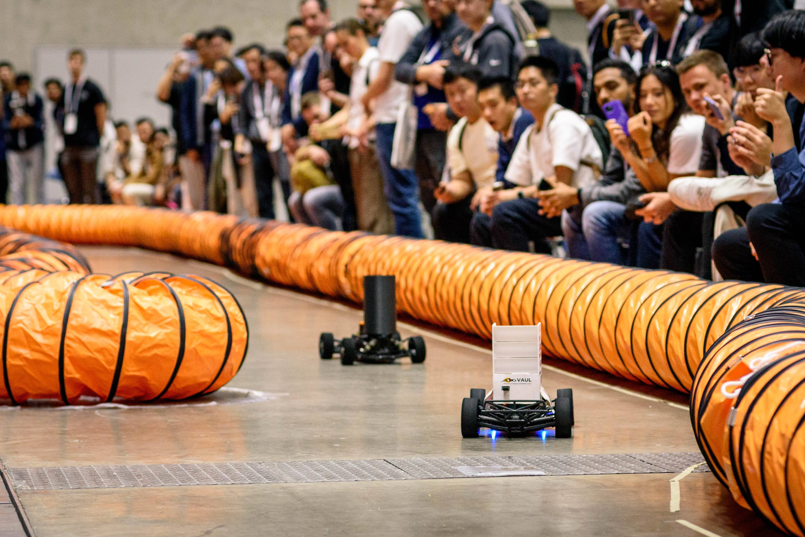

# Competing in F1TENTH with *ForzaETH*

Participating in robotics competitions has always been important to me -- I've done it in one way or another since high school. 

I had the privillege of competing in the F1Tenth autonomous driving competition, for 1/10 scale RC cars. Initially, I focused more on robust localizaiton, but subsequently dabbled in improving our trajectory planning and perception.

Our *ForzaETH* team has been very successful, and I couldn't be more proud of what they've achieved. The story is better told on their blog posts, so I defer there.

I was involved in three races:

- [First Place at ICRA 2023](https://www.forzaeth.ch/blog/icra_23/)
- [Third Place at ICRA 2024](https://www.forzaeth.ch/blog/icra_24/)
- [Third Place at IROS 2024](https://www.forzaeth.ch/blog/iros_24/)

And also did a little cheeky thing with a slightly [souped-up particle filter](https://www.forzaeth.ch/blog/synpf_paper/) for localization.

What's cool is that the [whole software stack](https://www.forzaeth.ch/blog/full_system_paper/) is open-source!

Now I'm at work, I really miss racing...

   

