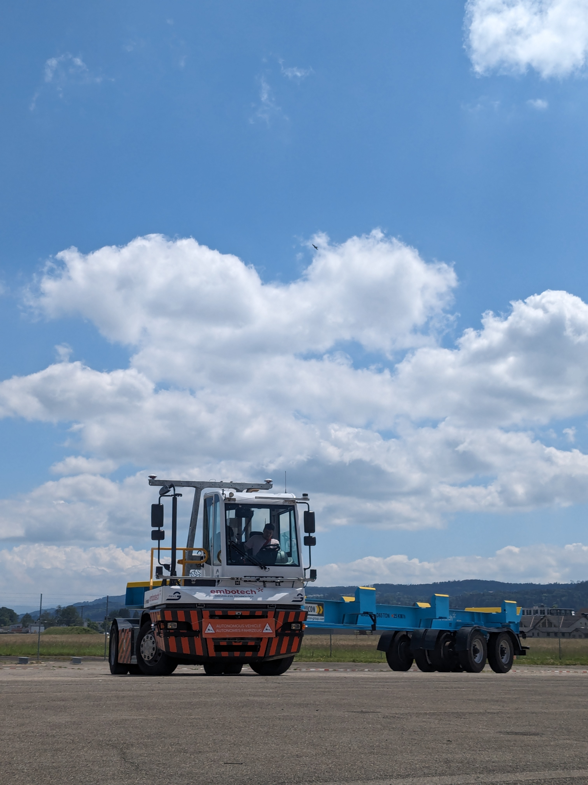
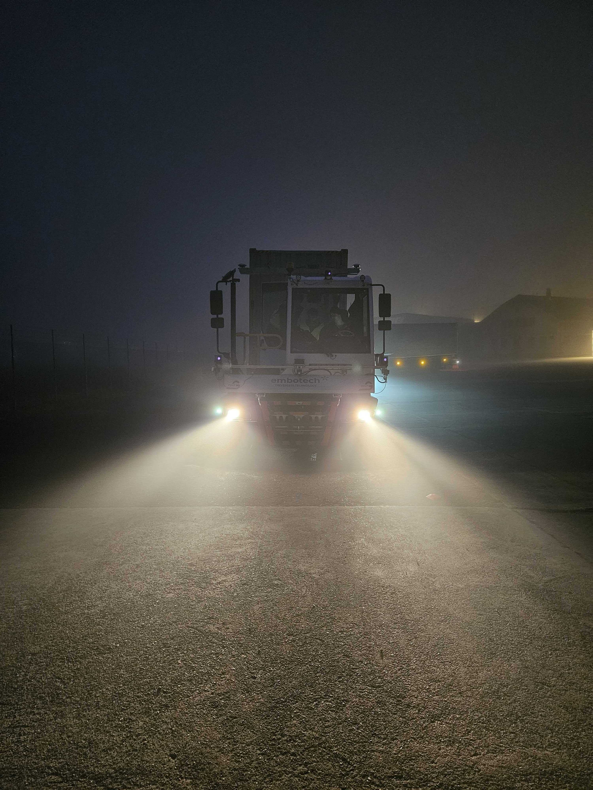

# Developing Perception for Autonomous Trucks at Embotech

From August 2023 to Feb 2024, I worked on LiDAR-based perception at [Embotech](https://www.embotech.com/). They are working on developing a L4-autonomous truck which shuttles containers around in shipping ports.

On a beautiful day (probably uncommon in the ports we designed this truck to operate in), the truck looks like this.

     

The internship was amazing! My other interns and I were given the chance to build part of the perception system, implementing established (classical) clustering algorithms customized to our truck platform. It boggles the mind how we were given the chance to architect, build, and test code that was running on a huge truck -- I really appreciate the trust that the company put in us!

I saw how important good systems engineers are. Working on algorithms is useful, but to build anything in the real world means integrating a number of systems. Which is hard. And systems engineers make or break this process.

After the 6-month internship, I continued part-time in a limited capacity, helping out with simulation-based testing for the algorithms. It was a challenge of its own -- but I thought it was a little more boring than breaking new ground, developing and testing new things.

I'll end off with another cool photo of the EmboTruck!

     

