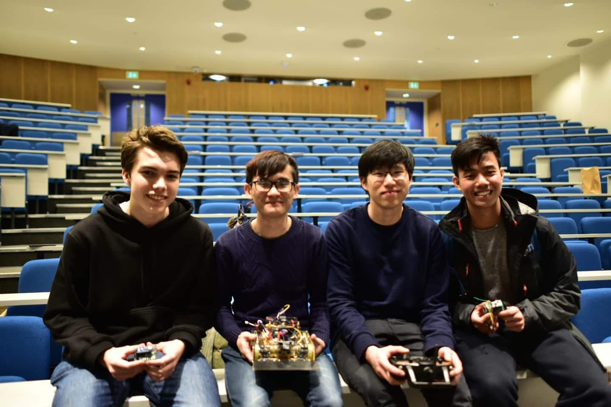
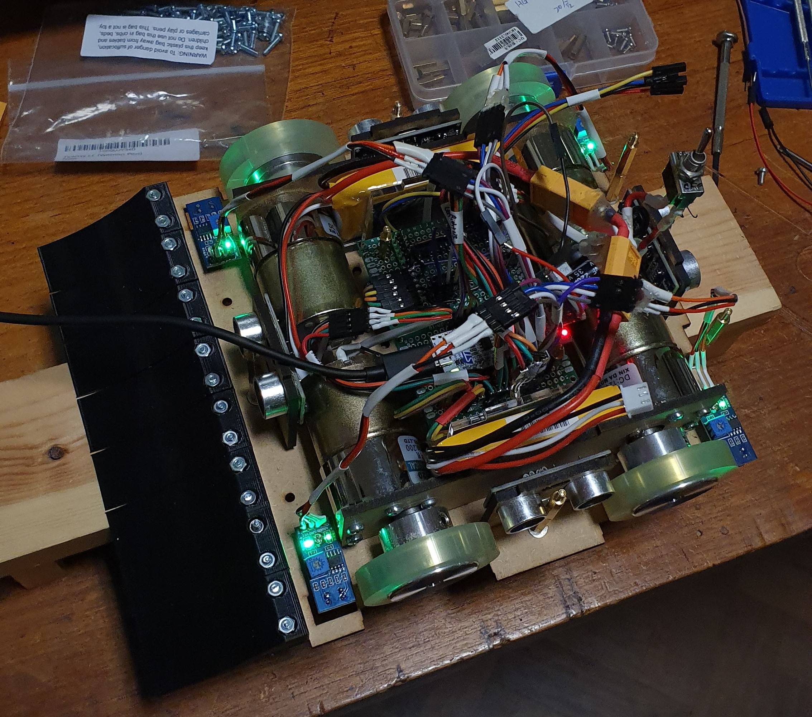
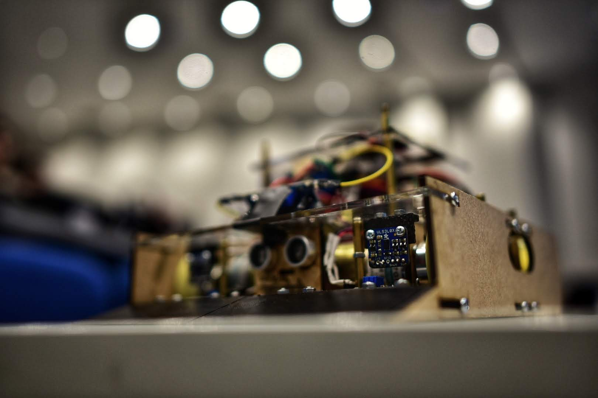

In 2020, my first year at Imperial, I joined the Imperial College Robotics Society's Sumobot competition.

  
   
  <i>Some members of my fantastic team, along with our robot.</i>

My team had grand plans for autonomy, but _someone_ (read: the author) accidentally plugged the batteries into the robot the wrong way the night before the competition. I then had to fix up a RC reciever to it along with an Arduino to give remote control to the robot.

  
   
  <i>Perhaps our wiring could have been re-thought.</i>

The robot chassis performed well, but unfortunately its autonomous performance will always remain a what-if for me.

  
   
  <i>Can you guess why we named our robot "Pagoda"?</i>

